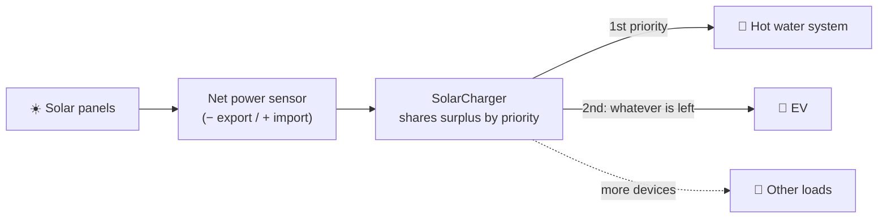

#  SolarCharger for Home Assistant

[![Stable][releases-shield]][releases] [![HACS Badge][hacs-badge]][hacs-link] ![Project Maintenance][maintenance-shield] [![GitHub Activity][commits-shield]][commits] [![License][license-shield]](LICENSE) ![Status][status-shield]
<!--
[![Downloads (all releases)][total-downloads]][solarcharger-link] [![Downloads (latest release)][latest-downloads]][solarcharger-link]
-->

[solarcharger-link]: https://github.com/flashg1/SolarCharger
[commits-shield]: https://img.shields.io/github/commit-activity/y/flashg1/SolarCharger.svg
[commits]: https://github.com/flashg1/SolarCharger/commits/main
[license-shield]: https://img.shields.io/github/license/flashg1/SolarCharger.svg
[maintenance-shield]: https://img.shields.io/maintenance/yes/2026.svg
[releases-shield]: https://img.shields.io/github/release/flashg1/SolarCharger.svg
[releases]: https://github.com/flashg1/SolarCharger/releases/latest
[hacs-badge]: https://img.shields.io/badge/HACS-Default-41BDF5.svg
[hacs-link]: https://hacs.xyz/
[status-shield]: https://img.shields.io/badge/status-work%20in%20progress-orange.svg
<!--
[total-downloads]: https://img.shields.io/github/downloads/flashg1/SolarCharger/total
[latest-downloads]: https://img.shields.io/github/downloads/flashg1/SolarCharger/latest/total
-->
<!--
[total-downloads]: https://img.shields.io/badge/dynamic/json?color=41BDF5&logo=home-assistant&label=integration%20usage&suffix=%20installs&cacheSeconds=15600&url=https://analytics.home-assistant.io/custom_integrations.json&query=$.solarcharger.total
[latest-downloads]: https://img.shields.io/badge/dynamic/json?color=41BDF5&logo=home-assistant&label=latest%20version&suffix=%20installs&cacheSeconds=15600&url=https://analytics.home-assistant.io/custom_integrations.json&query=$.solarcharger.versions['0.13.1']
-->

> **Stop selling your sunshine to the grid for cents. Heat your water and charge your car with it instead.** ☀️🚿🚗

EV and hot water are often the two biggest electricity users in a home, and both are perfect for soaking up surplus solar. SolarCharger watches how much power your home is exporting to or importing from the grid, and shares the surplus between them **in the order you choose**. For example, it can heat the hot water tank first and then send whatever's left to the car. When clouds roll in, it throttles back or pauses. When the sun returns, it picks up again. Need the car full by 7am tomorrow? It can plan for that too, topping up from the grid only as much as it has to.

It works with Tesla, OCPP chargers and a growing list of other EVs, hot water systems, and with anything else you can switch on and off, like heaters.

**[Quick start](#quick-start)** · **[Hot water first](#-hot-water-first-car-second)** · **[Features](#features)** · **[Supported integrations](#supported-integrations)** · **[Installation](#installation)** · **[Wiki](https://github.com/flashg1/SolarCharger/wiki)**


## How it works



A single "Net power" sensor is the feedback loop. Negative watts means you're exporting, so SolarCharger hands out more power. Positive watts means you're importing, so it pulls power back, starting with the lowest-priority device. If there isn't enough surplus for a device over the whole [power monitor duration](https://github.com/flashg1/SolarCharger/wiki/User-guide#power-monitor-duration), that device is paused until there is.


## 🚿 Hot water first, car second

A resistive hot water element can draw around 3.6 kW. Heating water is one of the cheapest ways to store your own solar: a hot tank is a battery you already own.

Here's how SolarCharger handles it when the hot water system has the higher priority:

1. **Morning:** once surplus solar is big enough to run the element, the hot water system gets it first.
2. **Spare power goes to the car.** Anything left over, beyond what the element draws, goes to the EV, whose charge current is adjusted up and down to match.
3. **Tank is hot:** when the thermostat switches the element off, SolarCharger stops reserving power for it and the car gets the full surplus.
4. **Clouds:** the car is throttled back first, so the hot water keeps heating for as long as possible.

Because a hot water element can only be switched on or off, not throttled, it only turns on when there's enough surplus to run it at full power.

**What you need:**
- **An on/off switch** for the element, e.g. a smart relay or contactor.
- **A current sensor** that measures the element's actual current draw in amps, e.g. from an energy-monitoring relay or a clamp meter. This is how SolarCharger knows whether the thermostat has switched the element off, so it can pass that power on to the car.

**Setup:** add the hot water system with **[Add custom device](https://github.com/flashg1/SolarCharger/wiki/Configuration#example-config-for-a-heater)**. Select the switch, and select the current sensor as **"Charger get charge current (AMP)"**. Then give it a higher priority than the car. See [priority and weighting](https://github.com/flashg1/SolarCharger/wiki/Configuration#charge-multiple-devices-at-the-same-time-based-on-priority-and-weight-for-each-device).


## Quick start

1. **Install** SolarCharger via HACS ([details](#installation)) and restart Home Assistant.
2. **Create a "Net power" sensor** that reads negative when exporting and positive when importing ([example](#configuration)).
3. **Add the integration**: Settings > Devices & services > Add integration > "SolarCharger", then click **Add charger device**.
4. **Set three values**: charger effective voltage, maximum current and maximum charge speed ([where](#configuration)).
5. **Plug in the car.** That's it. SolarCharger takes over within about a minute.


## Features

### ☀️ Solar tracking
- **Charge on surplus solar only.** Charge current follows your "Net power" sensor up and down throughout the day.
- **Charge across multiple days.** [Sun elevation triggers](https://github.com/flashg1/SolarCharger/wiki/User-guide#sun-trigger) start and stop charging automatically, morning and evening.
- **Smart pause and resume.** [Power monitor duration](https://github.com/flashg1/SolarCharger/wiki/User-guide#power-monitor-duration) decides when there's too little sun. The charger is switched off while paused.
- **Match your charger's steps.** [Configurable step current](https://github.com/flashg1/SolarCharger/wiki/User-guide#step-current-list) for chargers that only accept certain amp values.
- **Cap your supply.** [Power source](https://github.com/flashg1/SolarCharger/wiki/User-guide#supply-cap) support - draw up to a set power offset from a home battery when solar falls short, including at night.

### 📅 Scheduling
- **A charge limit for every day of the week.** [7-day charge limit schedule](https://github.com/flashg1/SolarCharger/wiki/User-guide#charge-limit-7-days-schedule). By default it uses the limit already set in the car.
- **Ready when you need it.** [Just-in-time charging](https://github.com/flashg1/SolarCharger/wiki/User-guide#next-charge-time) reaches your charge limit by the end time you set, using solar first and grid if needed.
- **Make hay while the sun shines.** [Automatically charges more today](https://github.com/flashg1/SolarCharger/wiki/User-guide#reduce-charge-limit-difference) if today has no completion time and the next 3 days need a higher limit.
- **Plays nicely with off-peak tariffs.** Compatible with night-time off-peak charging.
- **Full speed between set times.** [Program the minimum charge current](https://github.com/flashg1/SolarCharger/wiki/Configuration#to-charge-at-maximum-current-between-specific-times), or set it manually.

### 🚿🚗 Hot water, cars and other loads
- **Hot water first.** Run your [hot water system](#-hot-water-first-car-second) on surplus solar, ahead of the car or after it: you choose the order.
- **Share the sun.** Power [multiple cars](https://github.com/flashg1/SolarCharger/wiki/Configuration#charge-multiple-devices-at-the-same-time-based-on-priority-and-weight-for-each-device) and [other loads](https://github.com/flashg1/SolarCharger/wiki/Design#create-your-own-custom-charger) at the same time. Higher-priority devices are served first, and devices with equal priority split the surplus by weighting.
- **On/off devices welcome.** Devices that can't adjust their current, like hot water elements and heaters, are switched on only when there's enough surplus to run them. A current sensor tells SolarCharger what they're actually drawing.

### 🔌 Hardware support
- **Car API, charger, or both.** Control the EV through its own API, and/or drive an OCPP-compliant charger. OCPP has been tested with the [OCPP simulator](https://github.com/lewei50/iammeter-simulator). OCPP and Tesla Fleet API support are in beta.
- **Wake up and find the car.** [Ping (ICMP) detects the car](https://github.com/flashg1/SolarCharger/wiki/User-guide#use-ping-to-detect-car-and-update-ha-to-get-latest-status) and keeps refreshing Home Assistant for up to 15 minutes until it's connected.
- **Bring your own device.** [Configurable return codes](https://github.com/flashg1/SolarCharger/wiki/Design#create-your-own-custom-charger) map your car's or charger's states to SolarCharger's connect, connected and charging stages.

### 🎛️ You stay in control
- **Override any time.** [Customise the "Charge" switch](https://github.com/flashg1/SolarCharger/wiki/Design#solarcharger-automation-triggers) and ["Min current"](https://github.com/flashg1/SolarCharger/wiki/Configuration#to-charge-at-maximum-current-between-specific-times) without SolarCharger fighting you.
- **Dashboards included.** Ready-made [SolarCharger cards](https://github.com/flashg1/SolarCharger/wiki/User-interface#solarcharger-cards).

### 🗺️ Roadmap
- **Charge more before the rain.** Automatically raise to the highest charge limit set within a rainy forecast period, taking the bad-weather charge limit setting into account. Disabled by default.
- **Gentler on your battery.** Keep a daily limit of 60% and only charge higher before a rainy period, which may prolong battery life.
- **Fine-tune the curve.** Skew the export/import curve left or right to minimise grid import.


## Supported integrations

Chargers from these integrations are pre-configured, so you can add them with the **Add charger device** button.

| Integration | Status | Charge current adjusted by |
|---|---|---|
| [Tesla Custom Integration](https://github.com/alandtse/tesla) v3.20.4+ \* | ✅ Used by the author | Car |
| [Tesla BLE MQTT docker](https://github.com/tesla-local-control/tesla_ble_mqtt_docker) (local, Bluetooth) | 👥 Community tested | Car |
| [ESPHome Tesla BLE](https://github.com/PedroKTFC/esphome-tesla-ble) v2026.2.1+ (local, Bluetooth) | 👥 Community tested | Car |
| [OCPP](https://github.com/lbbrhzn/ocpp) (local) | 👥 Community tested | Charger |
| [Tesla Fleet](https://www.home-assistant.io/integrations/tesla_fleet) \* | 👥 Community tested | Car |
| [Tessie](https://www.home-assistant.io/integrations/tessie) \* | 👥 Community tested | Car |
| [Teslemetry](https://www.home-assistant.io/integrations/teslemetry/) \* | 🧪 Beta | Car |
| [MySkoda](https://github.com/skodaconnect/homeassistant-myskoda) | 🧪 Beta | Charger only |
| [BYD vehicle](https://github.com/jkaberg/hass-byd-vehicle) | 🧪 Beta | Charger only |
| [GWM Ora](https://github.com/moryoav/ha-gwm) | 🧪 Beta | Charger only |
| [Hyundai Kia Connect](https://github.com/Hyundai-Kia-Connect/kia_uvo) | 🧪 Beta | Charger only |
| [Geely Connect](https://github.com/YossiKon/geely-connect) | 🧪 Beta | Charger only |
| [Volvo](https://www.home-assistant.io/integrations/volvo) | 🧪 Beta | Charger only |
| [MG SAIC](https://github.com/townsmcp/mg-saic-ha) | 🧪 Beta | Charger only |

\* API requires a paid subscription in most countries. See [charger current update period](https://github.com/flashg1/SolarCharger/wiki/Installation#charger-current-update-period) for how API polling interval affects control.

I only use the Tesla Custom Integration myself, so the others have been tested by users. Please ask in [GitHub discussions](https://github.com/flashg1/SolarCharger/discussions) if you get stuck.

**Car can't adjust its own current?** See the [work-around](https://github.com/flashg1/SolarCharger/wiki/Configuration#how-to-control-vehicle-charge-current).

**Integration not listed?** Use **[Add custom device](https://github.com/flashg1/SolarCharger/wiki/Configuration#example-config-for-a-heater)** and pick your own control entities. An on/off switch is the minimum:
Settings > Devices & services > SolarCharger > Settings (cog wheel) > Select your custom device > Select your charge control entities > Submit

**Got it working?** Please add your setup to the [poll](https://github.com/flashg1/SolarCharger/discussions/8) and [config](https://github.com/flashg1/SolarCharger/discussions/9) threads to help the next person. Thanks!

### Tested with (author's setup)
- [Home Assistant](https://www.home-assistant.io/)
- [Enphase Envoy](https://www.home-assistant.io/integrations/enphase_envoy) with a 20-second update interval
- [Tesla Custom Integration](https://github.com/alandtse/tesla), controlling the car via the Tesla cloud
- Tesla UMC charger, 230V, max 15A
- Tesla Model 3
- Hot water system with a resistive element (about 3.6 kW, 15A), switched on and off by SolarCharger via contactor with higher priority than the car, and a sensor reading its current draw


## Installation

### Install via HACS (recommended)
The [Home Assistant Community Store (HACS)](https://www.hacs.xyz/) gives you a UI to manage custom integrations like SolarCharger. [Install and configure HACS](https://www.hacs.xyz/docs/use/) first, then:

[](https://my.home-assistant.io/redirect/hacs_repository/?owner=flashg1&repository=SolarCharger&category=Integration)

1. Go to **HACS > Integrations** in Home Assistant.
2. Search for and install the **SolarCharger** integration.
3. Restart Home Assistant.

### Manual install
1. Copy the `solarcharger` directory to your Home Assistant machine:
   ```
   From:  <Your git clone directory>\SolarCharger\custom_components\solarcharger
   To:    \\homeassistant.local\config\custom_components\solarcharger
   ```
2. Restart Home Assistant.


## Configuration

1. **Add the integration:** Settings > Devices & services > Add integration > search for "SolarCharger".

2. **Create a net power sensor.** It must read **negative watts when exporting** to the grid and **positive watts when importing**. Enphase already works this way. For other inverter brands, adjust the template so it matches. Example for Enphase:
   ```
   Settings > Devices & services > Helpers > Create helper > Template > Template a sensor >

   Name: Net power
   State template: {{ states('sensor.envoy_[YourEnvoyId]_current_net_power_consumption')|int }}
   Unit of measurement: W
   Device class: Power
   State class: Measurement
   Device: Envoy [YourEnvoyId]
   ```

3. **Add a charger device**, e.g. Tesla, OCPP, etc.

4. **Set these after adding the charger:**

   | Where | Setting |
   |---|---|
   | SolarCharger > Global defaults > Configuration | Charger effective voltage |
   | SolarCharger > Local device > Configuration | Maximum current |

   See [required configs after installation](https://github.com/flashg1/SolarCharger/wiki/Installation#what-configs-are-required-after-installation) for more.

**BLE and OCPP users:** see the matching section in the [FAQ](https://github.com/flashg1/SolarCharger/wiki/FAQ) for a few extra steps.


## How to use

Set your car's charge limit and plug in. Normal constant-current charging starts immediately (unless schedule charging is enabled), and SolarCharger takes over shortly after to manage the current during daylight hours. If nothing happens, see [automation cannot be triggered](https://github.com/flashg1/SolarCharger/wiki/User-guide#automation-cannot-be-triggered).

Then pick a mode:

### ☀️ Solar only (default)
Just plug in. Charging starts at 6A, and after about a minute the current adjusts to match how much power you're exporting to the grid.

### ⚡ Fast charge
Toggle on **"Fast charge mode"** to charge at full speed from solar plus your secondary power source.

**Charging stops** when the car reaches its charge limit or the charger is turned off. **To abort**, toggle off the "Charge" switch.

There's much more in the [wiki](https://github.com/flashg1/SolarCharger/wiki).


## Support the project

If SolarCharger saves you money, please :star: the repo, and maybe buy me a coffee!

[](https://ko-fi.com/flashg1)


## Disclaimer
This custom integration has been created with care, but the author cannot be held responsible for any damage it causes. Use at your own risk.
